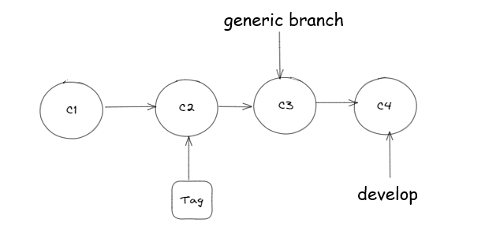
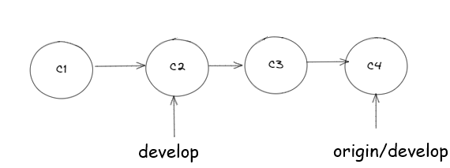
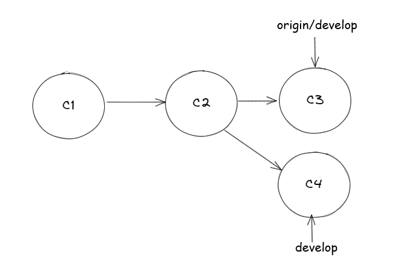
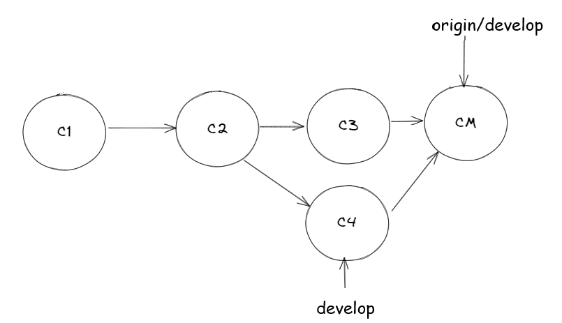
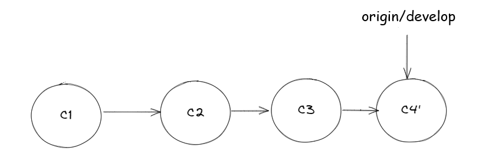
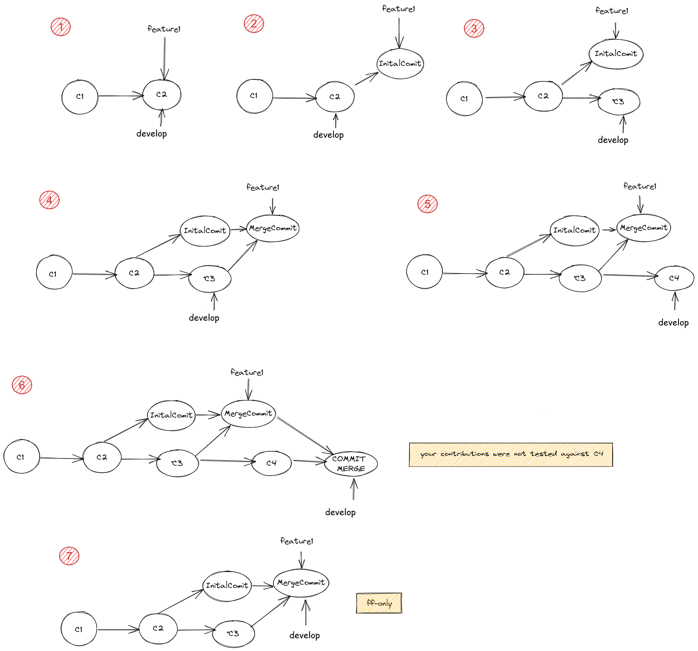
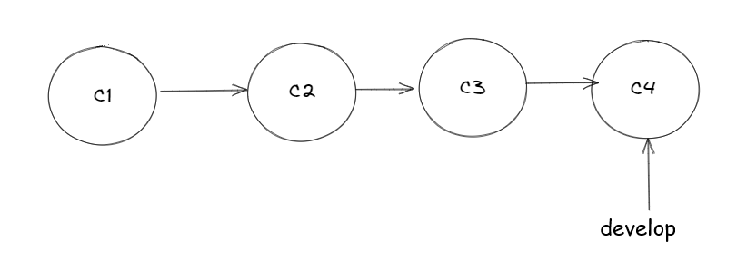
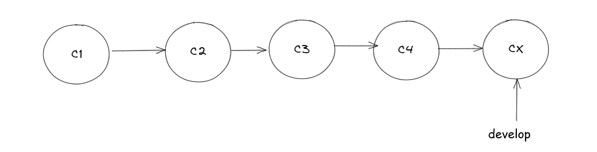

# Table of contents

- [How To Read this document](#how-to-read-this-document)
  - [Basics items](#basics-items)
    - [Item 1: what's happening: git status](#item-1-whats-happening-git-status)
    - [Item 2: how to commit: git commit](#item-2-how-to-commit-git-commit)
    - [Item 3: references update: git fetch](#item-3-references-update-git-fetch)
    - [Item 4: differences between references](#item-4-differences-between-references)
    - [Item 5: keep safe your contributions](#item-5-keep-safe-your-contributions)
  - [Intermediate items](#intermediate-items)
    - [Item 6: the simplest Git workflow: feature branch](#item-6-the-simplest-git-workflow-feature-branch)
    - [Item 7: my push was rejected, what can I do?](#item-7-my-push-was-rejected-what-can-i-do)
    - [Item 8: a dry run approach to git merge](#item-8-a-dry-run-approach-to-git-merge)
    - [Item 9: how to approach conflicts](#item-9-how-to-approach-conflicts)
    - [Item 10: why sometimes fast-forward is better](#item-10-why-sometimes-fast-forward-is-better)
    - [Item 11: restore a repo to a specific commit: the right way](#item-11-restore-a-repo-to-a-specific-commit-the-right-way)
    - [Item 12: spot a problem: force updated](#item-12-spot-a-problem-force-updated)
  - [Advanced items](#advanced-items)
    - [Item 13: update last commit: git amend](#item-13-update-last-commit-git-amend)
    - [Item 14: rebuild history: rebase](#item-14-rebuild-history-rebase)
    - [Item 15: rebuild history #2: interactive rebase](#item-15-rebuild-history-2-interactive-rebase)
    - [Item 16: Git insights: git reflog](#item-16-git-insights-git-reflog)
    - [Bonus Item: happy git!](#bonus-item-happy-git)

# How To Read this document

This document wants to be a reference for best practices in the daily use of Git, despite the complexity of this tool it is worth mentioning that Git is a tool that track the changes in a repository (that is, a folder that contains files and a hidden folder named .git which contains all the needed metadata to achieve the tracking).

Some concepts are stressed by the author for one simple reason: the main goal of Git is tracking the changes and years of experience have shown that Git is very good at that. However, this is not for free, it requires some attentions by Individual Contributors (the engineers who commit changes, henceforth referred to as IC).

The history of a Git repository shows all the contributions, and if ICs don’t follow some simple rules, it can easily turn into a mess, in fact losing the primary goal: tracking changes effectively.

Moreover, having a good history allows for some tasks, like understanding what happened, learning how to implement something, and helping the reviewer when faced with Pull requests.

Git, like other tools, was designed to allow several ICs to work together efficiently.

This document is divided into items, each of which is designed to explain the pros and cons of each method.

Each item is presented with the usage of the command line tool and requires a basic knowledge of Git, furthermore, the reader is strongly invited to read [https://git-scm.com/book/en/v2](https://git-scm.com/book/en/v2) (especially the chapters 1. Getting Started, 2. Git Basics, and Git Branching).

Items are arranged into three categories: basics, intermediate, and advanced, while the first two show safe practices and the last one shows how to rewrite the history, which can be safe on a branch that is not shared with other ICs but is forbidden when other ICs are working on the same branch.


## Basics items

A very quick introduction to how a Git repo works: code contributions are grouped into commits, but what is a commit? It is just a patch https://en.wikipedia.org/wiki/Patch_(computing) and whose hash function (currently sha1sum but with ongoing discussions to upgrade it) is referred to as the commit ID. That is, the repo history can be seen as a series of commit IDs. Each of them describes the changes brought about by that specific commit.
A branch can be seen as a reference to a specific commit ID and therefore to all ancestor commits, and if a specific commit ID is important for some reason it can be tagged.



### Item 1: what's happening: git status
Git status is the most powerful and simple command that tells you what is happening in your repo. It does even more; in fact, it suggests what you can do, showing the commands you need. Let's look at some examples to see the most common scenarios:

#### Nothing to do
```bash
~/repos/testrepo$ git status
On branch develop
Your branch is up to date with 'origin/develop'.

nothing to commit, working tree clean
```
#### There is some changes in the local branch
```bash
~/repos/testrepo$ git status
On branch master
Your branch is up to date with 'origin/master'.

Changes not staged for commit:
  (use "git add <file>..." to update what will be committed)
  (use "git restore <file>..." to discard changes in working directory)
       	modified:   new.md

Untracked files:
  (use "git add <file>..." to include in what will be committed)
       	images/simplerepo.png

no changes added to commit (use "git add" and/or "git commit -a")
``` 
Git is telling us that on branch master:

- Some changes in the file new.md can be moved to the stage area.
- There is a new file called simplerepo.png that can be added to the repo.

#### There are some updates in the remote branch.
```bash
~/repos/testrepo$ git status
On branch develop
Your branch is behind 'origin/develop' by 2 commits, and can be fast-forwarded.
  (use "git pull" to update your local branch)

nothing to commit, working tree clean
```
Git is telling us that the branch develop that is tracking the remote branch origin/develop is behind by 2 commits. That is, some IC has added its own contributions, C3 and C4.



The current reference develop can easily be fast-forwarded in order to point to C4 with:
```bash
$ git pull
```
or
```bash
$ git merge origin/develop
```
The command git pull is a shorthand for git fetch && git merge origin/develop -> see item 3 for insights on git fetch

### Item 2: how to commit: git commit
When all changes are ready and all tests have passed (e.g., mvn clean install is OK), It is time to stage the changes that must be committed. To do that
```bash
$ git add -p
```
for each snippet a prompt will ask if the change must be committed or not, once that all changes are in stage
```bash
$ git commit
```
A well formatted commit message should be contain:
- the first line - title of the commit and if available the ticket ID
- blank line
- A summary of the changes and useful commments for next consultant

### Item 3: references update: git fetch
Git is a distributed version control, it allows more ICs to share contributions, information transport is done with SSH and HTTP protocol, among the repositories one is chosen as origin repo. But this is only a convention, there is no way to know what happens to the others repository unless fetch is used:
```bash
$ git fetch
~/repos/testrepo$ git fetch
remote: Counting objects: 200, done.
remote: Compressing objects: 100% (139/139), done.
remote: Total 200 (delta 76), reused 3 (delta 1)
Receiving objects: 100% (200/200), 34.46 KiB | 1008.00 KiB/s, done.
Resolving deltas: 100% (76/76), completed with 21 local objects.
From https://foobar.com.com/scm/path/testrepo
   1ffa340..71b62d8  feature/feature1-develop -> origin/feature1-develop
   e59d286..e3ffe3c  feature/feature2-develop -> origin/feature2-develop
```
It is worth pointing out that fetch doesn't update nothing, only the references get updated. That is, it is always safe run git fetch.
In the above case we noticed that two branches received updates in the syntax: oldsha..newsha localbranch -> remote tracked branch

### Item 4: differences between references
In any moment, differences between two references could be done using the git diff command, and considering that a Git reference could be a TAG, a commit ID, a branch name

```bash
$ git fetch
$ git diff # show the contributions that are not yet in staged area
$ git diff HEAD 1.0.0 # show differences between local branch and tag 1.0.0
$ git diff develop origin/develop # show differences between local branch and tag 1.0.0
$ git diff develop origin/master # show differences between local branch and remote master
```
The output format is the one used by Patch:
```bash
~/repos/gitcourse$ git diff 008323949d8fe0af977af8980e5f3c0d9d0c6b07 f2de6c316b2ad361ede73461d25c260642e87108
diff --git a/README.md b/README.md
index 5e8fe7e..c101e79 100644
--- a/README.md
+++ b/README.md
@@ -52,11 +52,11 @@
 #### Advanced Commands
 - git reflog
 - git reset --hard origin/master
-- git reset 'commit'
+- git reset <commit>
```
### Item 5: keep safe your contributions
Let's suppose you are working on a long task, let's say one or two week task, there are several reasons which suggest that committing and pushing very often these changes can bring several benefits:
- In case of PC failures, your work is safe
- Your contributions can be easily shared with others ICs for suggestions, help
- Optionally reviewers can get on with the job
- Safely pause a task, doing something else, and resume that task (even after days)

## Intermediate items

### Item 6: the simplest Git workflow: feature branch
Let's suppose we are asked to work on the feature find button, then a branch feature-findbutton is branched-off from the mainline
```bash
$ git checkout develop
$ git pull #just to be sure that our branch is updated with remote
$ git checkout -b feature-findbutton # create feature branch
$ git push --set-upstream origin feature-findbutton # push branch to remote
```
Implementing the feature day 1
```bash
$ git fetch && git merge origin/develop # take contributions from mainline and fix conflicts
$ vim file1 #edit file
$ git commit -am 'C1'
$ git push origin feature-findbutton 
```

Implementing the feature day N
```bash
$ git fetch && git merge origin/develop # take contributions from mainline and fix conflicts
$ vim file1 #edit file
$ git commit -am 'CN'
$ git push origin feature-findbutton 
```
And finally when the feature is ready (optional)
```bash
$ git checkout develop
$ git merge --squash --ff-only feature-findbutton
$ git commit -m 'Merge pull request #feature-findbutton'
$ git push origin develop
```
The last bunch of commands was tagged optional because using Pull Request on bitbucket/github/gitlab needs an approval from reviewers and than the UI will show the merge button. That is, last operations can be done with one click.

### Item 7: my push was rejected, what can I do?

```bash
~/repos/testrepo$ git push
To https://foobar.com.com/scm/user/testrepo.git
 ! [rejected]        master -> master (fetch first)
error: failed to push some refs to 'https://foobar.com/scm/user/testrepo.git'
hint: Updates were rejected because the remote contains work that you do
hint: not have locally. This is usually caused by another repository pushing
hint: to the same ref. You may want to first integrate the remote changes
hint: (e.g., 'git pull ...') before pushing again.
hint: See the 'Note about fast-forwards' in 'git push --help' for details.
```
like other use cases Git is telling us why the updates were rejected



Some IC pushed to remote the commit C3 and now we are trying to push the commit C4. We can resolve basically in two ways, one is suggested above by Git, the other one is rebasing: in both cases the aim is done but in the first case we will have a merge commit, in the latter the history will be more clean (sometimes on purpose you would have the commit merge, just to track the merge)

#### Pull approach
```bash
$ git pull # or git fetch && git merge origin/develop
$ git push
```


Looking from CM towards the left, the history contains all commits plus the merge commit (which is a commit like others)

#### Rebasing approach
```bash
$ git rebase origin/develop
$ git push
```


It is worth noting that no merge commit was generated but the commit C4 was replaced by the commit C4'. That is, the commit C4 was turned into C4' in order to be added on top of C3 (C4 was on top of C2)

### Item 8: a dry run approach to git merge
Sometimes you want to try a merge but without actually make it. To do that one strategy is created temporary branch and try it, in this case if this branch is already pushed we can ask for help to other IC without any risk

Suppose the target branch is develop and the feature branch is feature1

```bash
$ git checkout feature1
$ git checkout develop
$ git checkout -b develop-try-merge
$ git checkout merge feature1
```
Once all merge activities are completed and we are satisfied from the outcome just:

```bash
$ git checkout develop
$ git checkout merge develop-try-merge
```
Even if this approach can appear too complex, just consider this use case: you are in the middle of merge (probably it will take you 2 days) using this approach, you can pause this task, do something else (for example facing with a production issue) and then resume the merge task

### Item 9: how to approach conflicts
Merging and rebasing can expose some little issues, such as conflicts. In quick summary, it means that two commits are changing the same line, and Git was not able to merge them applying the default merge strategy, so it is asking IC to manually solve the conflict.
Again, using the git status command, Git tells us which files contain conflicts. Once all conflicts are solved, compilation and testing are successfully done.
```bash
~/repos/testrepo$ git pull
Auto-merging Minor fix
CONFLICT (content): Merge conflict in Minor fix
Automatic merge failed; fix conflicts and then commit the result.
```
```bash
~/repos/testrepo$ git status
On branch master
Your branch and 'origin/master' have diverged,
and have 1 and 5 different commits each, respectively.
  (use "git pull" to merge the remote branch into yours)

You have unmerged paths.
  (fix conflicts and run "git commit")
  (use "git merge --abort" to abort the merge)

Changes to be committed:
       	new file:   file1.txt
       	new file:   file2.txt

Unmerged paths:
(use "git add <file>..." to mark resolution)
     	both modified:   file3.txt
```
In fact, opening file3.txt, you will find this content:

```bash
~/repos/testrepo$ cat file3.txt
<<<<<<< HEAD

this line 1
=======
this line 1
this line 2
this line 3
>>>>>>> ab8106e6b692ff14d5b6fa345021c7e61ceeefda
```
Once file3.txt is edited, just run (as suggested above by git status):
```bash
$ git add file3.txt 
$ git commit
```

### Item 10: why sometimes fast-forward is better
The picture below explains why we chose a fast forward merge strategy when a feature branch is going to be merged into mainline develop. If the feature branch is merged with step 6 then all the contributions contained in feature1 were not tested against what c4 has brought. To prevent that one, step 7 is the right approach in fact feature1 can be merged only if no new contributions are committed in develop since the last merge of develop into feature1



### Item 11: restore a repo to a specific commit: the right way
Let's suppose our repo


And we want to restore the repo how it looked like when it was in C2, all necessary is running the following commands:
```bash
$ git rm -rf *
$ git checkout C2 . #note the dot at the end of git checkout
$ git commit -m 'Restore to C2'
```


And the rationale behind 'the right way' is for two reasons:
- The history remains consistent (no rewriting)
- All changes are contained in one commit that can easily revert with:
```bash
$ git revert CX
```
### Item 12: spot a problem: force updated
```bash
~/repos/pippo11$ git fetch
remote: Counting objects: 9, done.
remote: Compressing objects: 100% (9/9), done.
remote: Total 9 (delta 6), reused 0 (delta 0)
Unpacking objects: 100% (9/9), 962 bytes | 7.00 KiB/s, done.
From https://foobar.com.com/scm/user/testrepo
 + 38b166c...c2b0abe master     -> origin/master  (forced update)
```
The last line indicates that there was an update on branch master, the big issue is that the update was forced, this means that the history of that branch was rewritten. Generally origin repo is configured to avoid that this can happen on some important branch like master or develop anyway this one can still happen on a short lived branch (like feature branch). It remembers important that each time the history is rewritten no one else will be able to commit on that branch anymore (unless reset the own version of that branch)

## Advanced items

### Item 13: update last commit: git amend
Let's suppose that you just committed (not yet pushed) and there is something that you want commit so it is time to use amend:
```bash
$ git commit --amend
```
Remember to use it only for those committs that are only in your local branch, otherwise you are going to break history for others ICs

### Item 14: rebuild history: rebase
We already saw this function in action on the item 6, now we can add something more on what already know. Rebasing is this principal tool for history rewriting

```bash
$ git checkout existing_feature_branch
$ git rebase develop
```
In few words, we asked Git to rewind the history of that current branch till a common ancestor commit, at that point just applying all commits of the current branch. If something get wrong Git will ask us to solve the conflicts.

### Item 15: rebuild history #2: interactive rebase
It works like rebase except, that is interactive, this means that the rebasing could be planned and decides if a commit must be melted into the previous one, edited or even deleted, etc. etc.
```bash
$ git rebase -i 
```
### Item 16: Git insights: git reflog
Git tracks all commands executed on the local repository. All the operations can be shown with reflog command
```bash
~/repos/core-services-cmlt-v1$ git reflog
5d80c9b (HEAD -> foobar, origin/develop, develop) HEAD@{0}: checkout: moving from develop to foobar
5d80c9b (HEAD -> foobar, origin/develop, develop) HEAD@{1}: pull: Fast-forward
bac5fe9 (origin/feature/feature22) HEAD@{2}: reset: moving to origin/develop
e80b719 HEAD@{3}: commit: Blabla
7c4bc6c HEAD@{4}: pull: Fast-forward
62b994f (tag: v1.0.0-rc2) HEAD@{5}: pull: Fast-forward
2e90498 HEAD@{6}: commit (amend): Minor fixes
8650e50 HEAD@{7}: rebase (continue) (finish): returning to refs/heads/develop
8650e50 HEAD@{8}: rebase (continue): Minor fixes
6fa2786 HEAD@{9}: rebase (start): checkout origin/develop
96a9246 HEAD@{10}: commit (amend): Minor fixes
0cd6399 HEAD@{11}: commit: Minor fixes
4c72dcf HEAD@{12}: pull: Fast-forward
```
It is also possible restoring the local repo to a specific point for example:

```bash
$ git reset --hard e80b719 
```
### Bonus Item: happy git!
Why is it always a good practice to consider develop as the source of truth? The reasons are that if all rules were applied, that code passed all tests and it is already shared with other ICs, which means that if something breaks in your local branch when you merge develop into it, it is likely that there is some issue in your branch. Therefore, before asking for help or claiming about bugs in develop, please double-check your branch.
